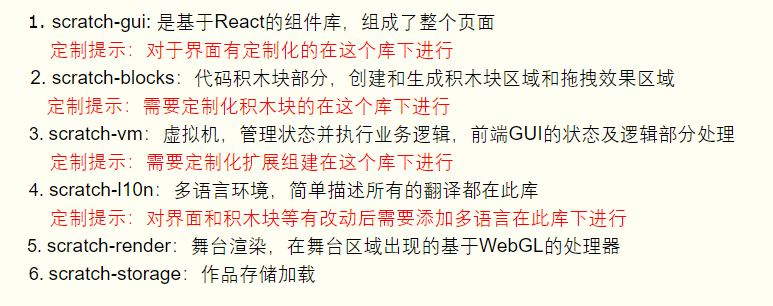
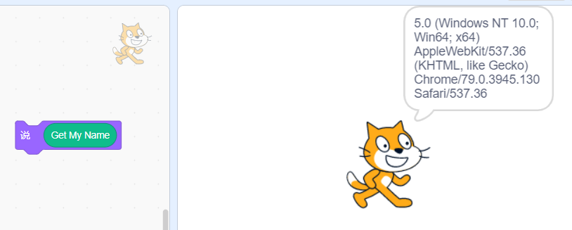

# 基于scratch的二次开发
- scratch架构  
  
    


- 项目结构

  


## 自定义品牌logo
  

menu-bar里存储了logo的静态资源，同时在menu-bar.jsx中引入该资源进而设置好自己的logo  

  

  

```
import minicodeLogo from './minicode-logo.png';

<div className={classNames(styles.menuBarItem)}>
    
</div>
```

  

menu-bar.jsx中设置了该导航栏的相关设置

## 自定义用户系统
- reducers/gui.js中设置项目用户相关的初始化信息
- components/gui/gui.jsx定义的GUIComponent组件定义了整个项目的基本样式结构
- reducers/mini-login.js用户登录信息
- mini-global/login-context.js登录相关逻辑

## 利用scratch-vm开发scratch extension
1. 在scratch-vm/src/extensions中创建新目录(scratch3_myextension)
2. 创建index.js
```
const BlockType = require('../../extension-support/block-type');

// 自己创建的extensions
class Scratch3MyBlocks {
    // runtime在绿色按钮触发时运行
    // runtime可以用来设计更复杂的功能
    constructor (runtime) {
        this.runtime = runtime;
    }

    //所有扩展都必须定义一个名为getInfo的函数，
    //该函数返回一个对象，该对象包含呈现块和扩展本身所需的信息。
    // 定义一个显示名称为My Information的积木区块
    getInfo (){
        return {
            id: 'myextension',
            name: 'My Information',
            // 一个显示名称为getMyName的积木
            // 预设的情况下会执行getMyName这个函式
            // 即下面的getMyName ()
            blocks: [
                {
                    opcode: 'getMyName',
                    blockType: BlockType.REPORTER,
                    text: 'Get My Name'
                }
            ]
        };
    }

    getMyName (){
        //返回该电脑浏览器信息
        return navigator.appVersion;
    }
}

module.exports = Scratch3MyBlocks;

```

3. 修改scratch-vm/src/extension-support/extension-manager.js  

```
const builtinExtensions = {
    // 引入新建的积木模块
    myblocks: () => require('../extensions/scratch3_myextension')
};
```

4. 选择extension的封面图片置于scratch-gui/src/lib/libraries/extension下
5. 修改scratch-gui/src/lib/libraries/extensions/index.js,引入图片，并引入新建的extension

```
//引入图片
import wakinghour from './Wakinghour.jpg';
```
在export default[]中引入
```
//引入新模块
{
    name: 'My Information',
    extensionId: 'myblocks',
    iconURL: wakinghour,
    description: 'The extesion for querying browser information (DEMO)',
    featured: true
},
```
- 效果

  

