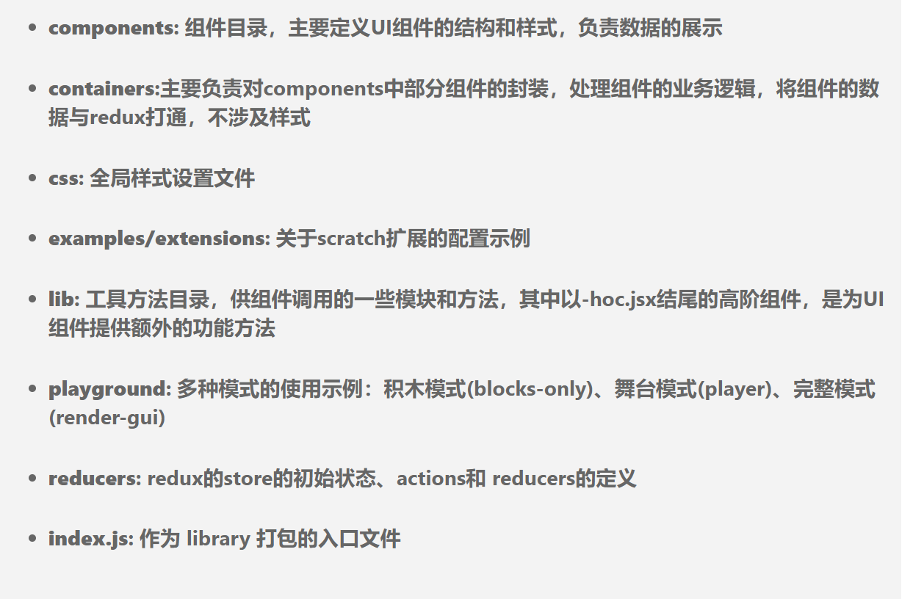
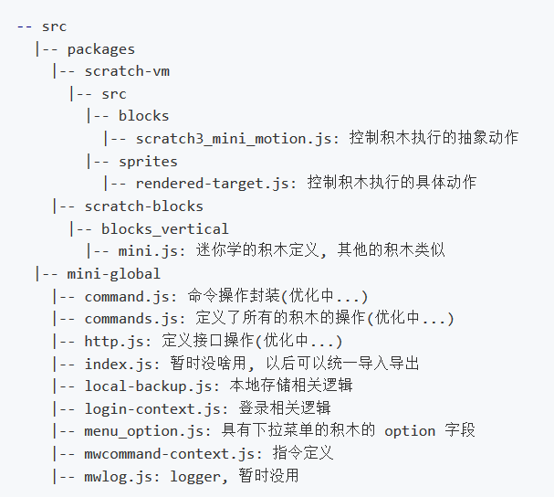
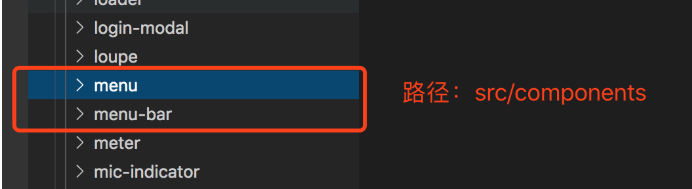
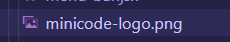
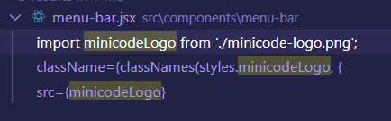
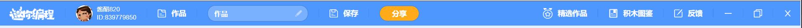

# 基于scratch的二次开发
- 项目结构

  



## 自定义品牌logo
  

menu-bar里存储了logo的静态资源，同时在menu-bar.jsx中引入该资源进而设置好自己的logo  

  

  

```
import minicodeLogo from './minicode-logo.png';

<div className={classNames(styles.menuBarItem)}>
    
</div>
```

  

menu-bar.jsx中设置了该导航栏的相关设置

## 自定义用户系统
- reducers/gui.js中设置项目用户相关的初始化信息
- components/gui/gui.jsx定义的GUIComponent组件定义了整个项目的基本样式结构
- reducers/mini-login.js用户登录信息
- mini-global/login-context.js登录相关逻辑